# 龔致珩 <span style="color:red">(106061518)</span>

#Project 4 / Face Detection with a Sliding Window

## Overview
The project is related to face detection. I extracted image feature by HOG and trained the 
classifier by Linear SVC. In testing, I use sliding window and guassian pyramid to 
detect the face localization.  

## Implementation
* <b>[proj4.py](../code/proj4.py):</b> Starter code
    * Some parameter setting
    ```
    feature_params = {'template_size': 36, #window size
                      'hog_cell_size': 3,  #hog cell size
                      'scale': 1.3}        #pyramid downsample scale
    num_negative_examples = 10000          #number for negative feature
    ```
* <b>[get_positive_features.py](../code/get_positive_features.py): </b> 
	* Get the hog feature by setting parameter from images and flipped images
	```
	im = imread(im_paths[idx], as_grey=True)
    features_pos[2*idx, :] = np.reshape(hog(im, feature_params['hog_cell_size']), D)
    im = np.fliplr(im)
    features_pos[2*idx+1, :] = np.reshape(hog(im, feature_params['hog_cell_size']), D)
	```
* <b>[get_random_negative_features.py](../code/get_random_negative_features.py): </b>
    1. Find image pyramid from images
    ```
    im = imread(im_paths[idx], as_grey=True)
    for (_, resized) in enumerate(pyramid_gaussian(im, downscale=feature_params['scale'])):
        if resized.shape[0] < window or resized.shape[1] < window:
                break
        im_pyramid.append(resized)
    ``` 
    2. Random select images and random crop selected image by window size to get HOG feature
    ```
    select = random.randint(0, len(im_pyramid)-1)
    im = im_pyramid[select].copy()
    h, w = im.shape
    crop_h = random.randint(0, h - window)
    crop_w = random.randint(0, w - window)
    features_neg[idx, :] = np.reshape(hog(im[crop_h:crop_h+window, crop_w:crop_w+window], feature_params['hog_cell_size']), D)
    ```
* <b>[svm_classify.py](../code/svm_classify.py): </b>
    * Setting SVC classifier to let it can predict probability and train it
    ```
    clf = svm.LinearSVC(C=0.05)
    clf = calibration.CalibratedClassifierCV(clf, method='sigmoid', cv=5)
    clf.fit(x, y)
    ```    
* <b>[run_detector.py](../code/run_detector.py): </b>
    1. Find image pyramid from testing image and get HOG feature from each size of images
    ```
     for (sc_idx, im_pyramid) in enumerate(pyramid_gaussian(ori_img, downscale=feature_params['scale'])):
         if im_pyramid.shape[0] < window or im_pyramid.shape[1] < window:
             break
         scale =feature_params['scale']**sc_idx
         feats = hog(im_pyramid, cell_size)
    ```
    2. Apply sliding window in the feature above
    ```
    cell_num = int(feature_params['template_size'] / feature_params['hog_cell_size'])
    feats_num = (feats.shape[0]-cell_num+1) * (feats.shape[1]-cell_num+1)
    crop_feats = np.zeros([feats_num, cell_num, cell_num, 31])
    idx = 0
    for y in range(0, feats.shape[0]-cell_num+1):
        for x in range(0, feats.shape[1]-cell_num+1):
            crop_feats[idx, :, :, :] = feats[y:y+cell_num, x:x+cell_num, :].copy()
            idx = idx + 1
    crop_feats = np.reshape(crop_feats, [feats_num, D])
    ```
    3. Classify the crop features by linear SVC and find the valid confidence by THRESH
    ```
    THRESH = 0.8
    conf = model.predict_proba(crop_feats)
    conf = conf[:, 1]
    conf_idx = np.argwhere(conf >= THRESH)
    py_conf = conf[conf_idx]
    ```
    4. Find the bounding boxes in one of image pyramid
    ```
    num_box = len(conf_idx)
    py_bboxes = np.zeros([num_box, 4])
    for idx in range(num_box):
        cur_image_ids = np.concatenate([cur_image_ids, np.reshape(test_images[i],[1,1])], axis=0)
        window_num = feats.shape[1]-cell_num+1
        xstep = conf_idx[idx] % window_num
        ystep = conf_idx[idx] // window_num
        py_bboxes[idx, 1] = ystep * cell_size * scale
        py_bboxes[idx, 0] = xstep * cell_size * scale
        py_bboxes[idx, 3] = py_bboxes[idx, 1] + window * scale
        py_bboxes[idx, 2] = py_bboxes[idx, 0] + window * scale
    ```
    5. Concat all the bounding boxes and confidences from image pyramid
    ```
    cur_bboxes = np.concatenate([cur_bboxes, py_bboxes], axis=0)
    cur_confidences = np.concatenate([cur_confidences, py_conf], axis=0)
    ```
    6. Run non-maximum suppression in test image
    ```
    is_maximum = non_max_supr_bbox(cur_bboxes, cur_confidences, ori_img.shape)
    cur_bboxes = cur_bboxes[is_maximum[:, 0], :]
    cur_confidences = cur_confidences[is_maximum[:, 0], :]
    cur_image_ids = cur_image_ids[is_maximum[:, 0]]
    ```
    7. Concat the image ids, the bounding boxes and confidences from all testing images
    ```
    bboxes = np.concatenate([bboxes, cur_bboxes], axis=0)
    confidences = np.concatenate([confidences, cur_confidences], axis=0)
    image_ids = np.concatenate([image_ids, cur_image_ids], axis=0)
    ```
## Installation
* python3.6
* cyvlfeat
* qdm
* sklearn
* skimage
* numpy

### Results
<center>
<p>
Precision Recall curve for the starter code.
<p>
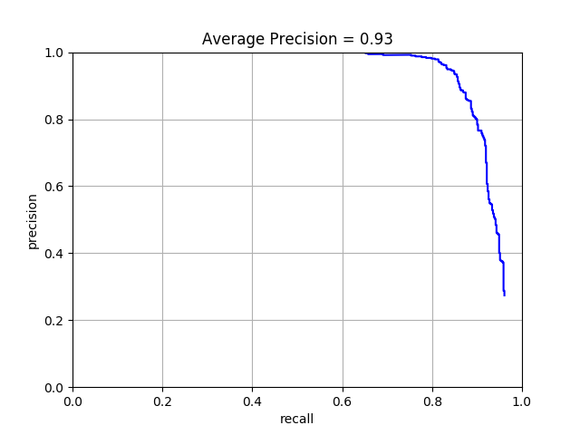
<p>
Example of detection on the test set from the starter code.
<table border=1>
<tr>
<td>
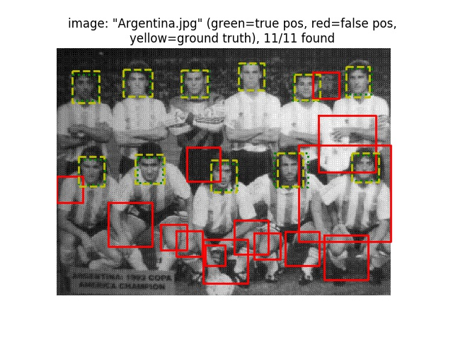
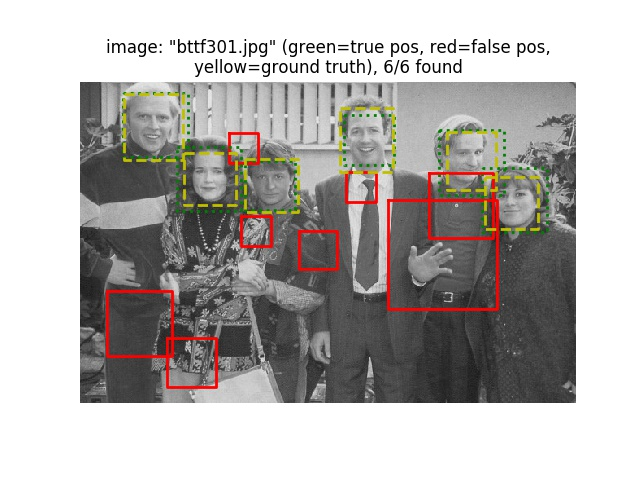
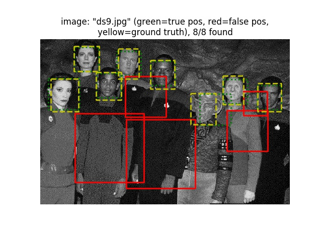
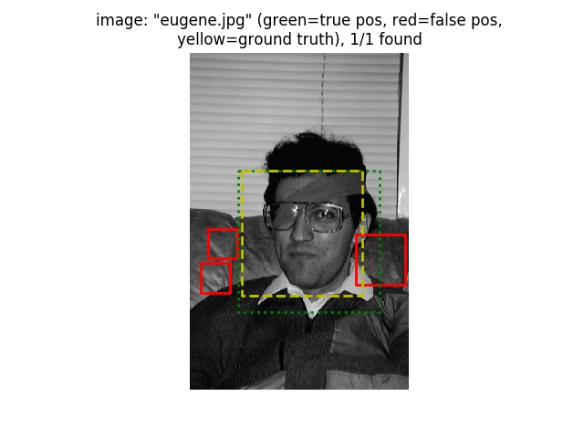
</td>
</tr>

<tr>
<td>
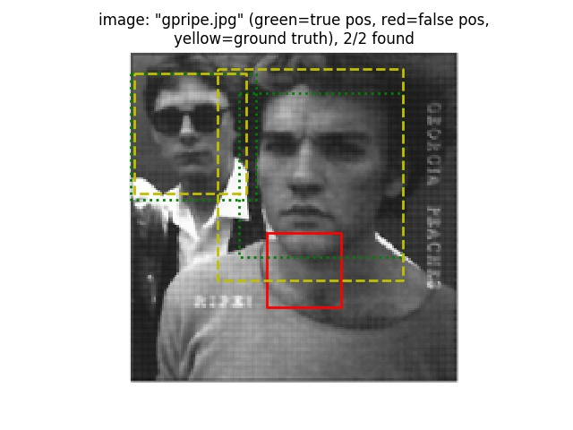
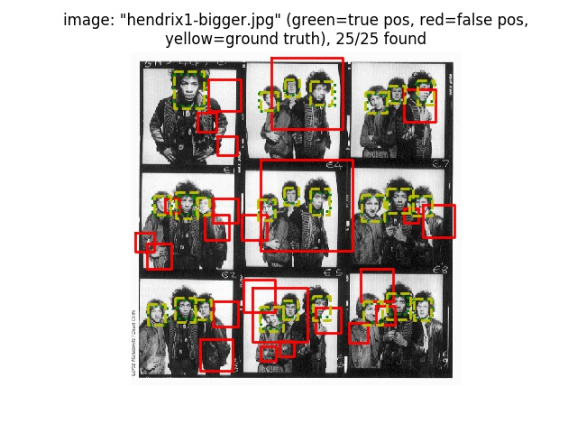
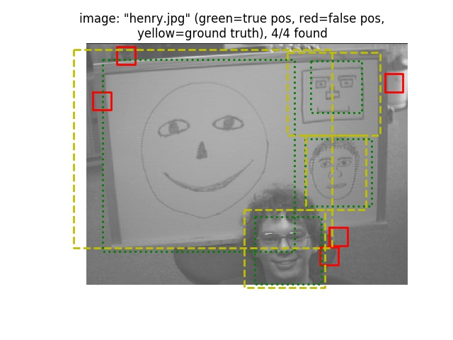
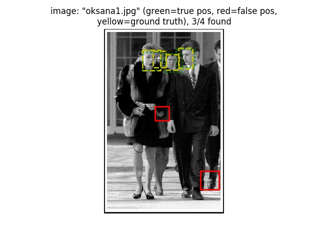
</td>
</tr>

<tr>
<td>
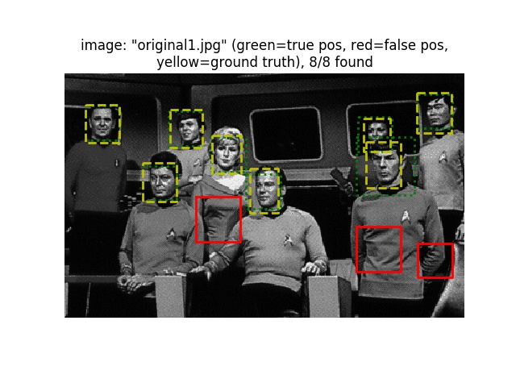
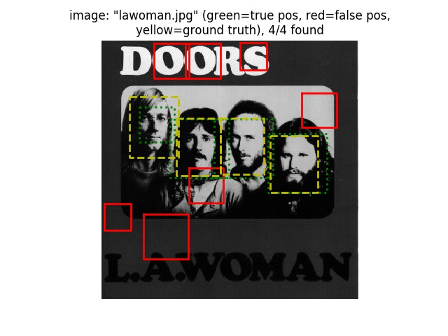
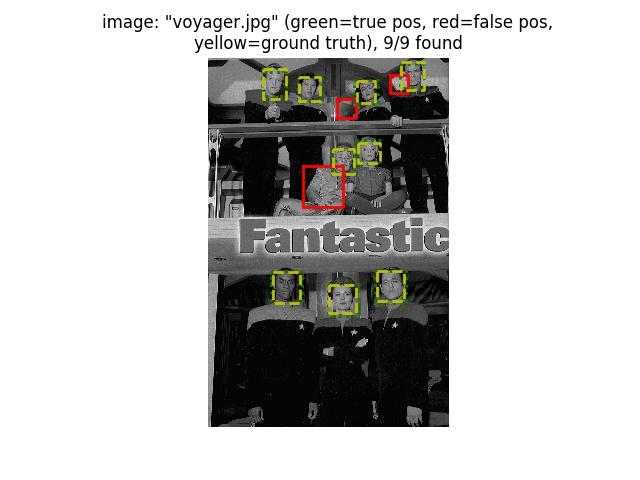
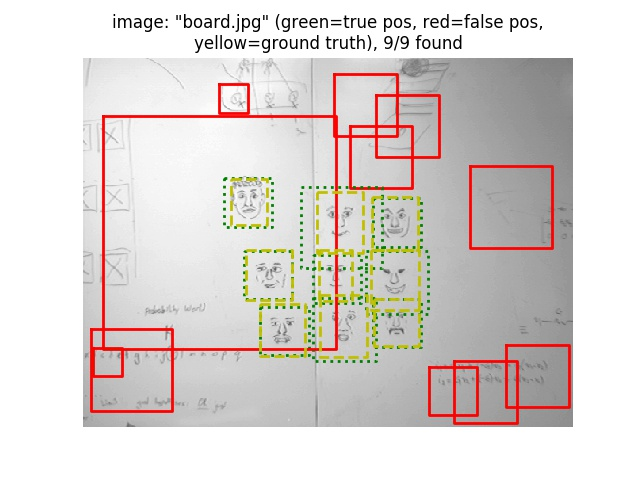
</td>
</tr>

</table>

</center>
